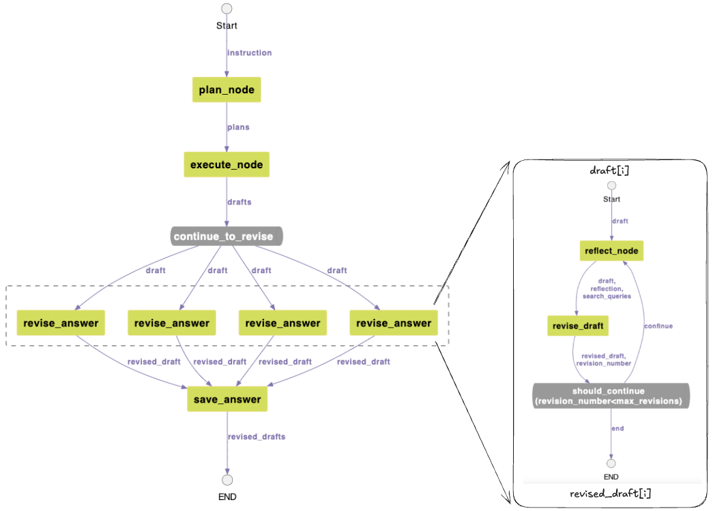

## 병렬처리 방법 (Map Reduce) 검토 (진행중)

[Map Reduce 방식의 병렬처리](https://github.com/kyopark2014/langgraph-agent/blob/main/map-reduce-parallel-processing.md)와 같이 [langgraph의 Send API](https://langchain-ai.github.io/langgraph/concepts/low_level/#send)를 이용하여 병렬처리 할 수 있습니다.

하지만, 아래와 같이 구현후에 revise_answer로 empty state가 지속적으로 전달되어서 정상적인 처리를 할 수 없었습니다. 현상으로 보아서 LangGraph 이슈로 보여져서 현상태에서는 기존처럼 노드에서 병렬처리를하고 Map Reduce 방식은 추후 재시도할 계획입니다.




revise_answer 노드에서는 draft 하나에 대해서 처리하게 되므로 save_answer 노드에서 revised_draft를 모아서 처리합니다. 따라서 아래와 같이 state에 revised_drafts을 추가합니다. 또한 workflow에서는 execute_node가 conditional edge인 continue_to_revise로 전달되고 drafts가 분산되어 revise_answer에서 처리되고, 이후로 save_answer 노드에서 결과를 모아서 처리합니다. 

```python   
class State(TypedDict):
    instruction : str
    planning_steps : List[str]
    drafts : List[str]
    final_doc : str
    word_count : int
    revised_drafts: Annotated[list, operator.add]

def buildLongFormWritingParallel():
    workflow = StateGraph(State)

    # Add nodes
    workflow.add_node("plan_node", plan_node)
    workflow.add_node("execute_node", execute_node)
    workflow.add_node("revise_answer", revise_answer)
    workflow.add_node("save_answer", save_answer)
    
    # Set entry point
    workflow.set_entry_point("plan_node")
        
    workflow.add_conditional_edges(
        "execute_node", 
        continue_to_revise, 
        ["revise_answer"]
    )
    
    # Add edges
    workflow.add_edge("plan_node", "execute_node")
    workflow.add_edge("execute_node", "revise_answer")
    workflow.add_edge("revise_answer", "save_answer")
    workflow.add_edge("save_answer", END)
        
    return workflow.compile()
```

아래와 같이 conditional edge인 continue_to_revise는 drafts에서 draft를 추출하여 revise_answer 노드로 전달됩니다. 

```python
def continue_to_revise(state: State):
    print('###### continue_to_revise ######')
    
    return [Send("revise_answer", {"draft": s}) for s in state["drafts"]]
```

이때 revise_answer 노드는 아래와 같이 ReviseState의 draft를 받아서 reflection을 수행하고 결과를 revised_drafts로 반환합니다. 

```python
class ReviseState(TypedDict):
    draft: str
    
def revise_answer(state: ReviseState):
    print("###### revise_answer ######")
    print('state (revise_answer): ', state)
    
    draft = state["draft"]        
    print('draft: ', draft)
        
    reflection_app = buildReflection()
                
    inputs = {
        "draft": draft
    }    
    config = {
        "recursion_limit": 50,
        "max_revisions": 1
    }
    output = reflection_app.invoke(inputs, config)
    # print('output (revise_answer): ', output)
                
    revised_draft = output['revised_draft']
    print('revised_draft: ', revised_draft)
        
    return {
        "revised_drafts": revised_draft
    }
```

아래와 같이 revise_answer 노드들의 revised_draft들이 save_answer 노드에 전달되어 모아집니다. 결과는 S3에 markdown과 html로 저장됩니다. 

```python
def save_answer(state: State):
    print("###### save ######")
    revised_drafts = state["revised_drafts"]        
    instruction = state['instruction']
        
    final_doc = ""
    for idx, revised_draft in enumerate(revised_drafts):
        final_doc += revised_draft + '\n\n'

    subject = get_subject(instruction)
    subject = subject.replace(" ","_")
    subject = subject.replace("?","")
    subject = subject.replace("!","")
    subject = subject.replace(".","")
    subject = subject.replace(":","")
        
    # markdown file
    markdown_key = 'markdown/'+f"{subject}.md"
        
    markdown_body = f"## {instruction}\n\n"+final_doc
                
    s3_client = boto3.client('s3')  
    response = s3_client.put_object(
        Bucket=s3_bucket,
        Key=markdown_key,
        ContentType='text/markdown',
        Body=markdown_body.encode('utf-8')
    )
        
    markdown_url = f"{path}{markdown_key}"
        
    # html file
    html_key = 'markdown/'+f"{subject}.html"
        
    html_body = markdown_to_html(markdown_body)
    print('html_body: ', html_body)
        
    s3_client = boto3.client('s3')  
    response = s3_client.put_object(
        Bucket=s3_bucket,
        Key=html_key,
        ContentType='text/html',
        Body=html_body
    )
        
    html_url = f"{path}{html_key}"
        
    return {
        "final_doc": final_doc+f"\n<a href={html_url} target=_blank>[미리보기 링크]</a>\n<a href={markdown_url} download=\"{subject}.md\">[다운로드 링크]</a>"
    }
```

